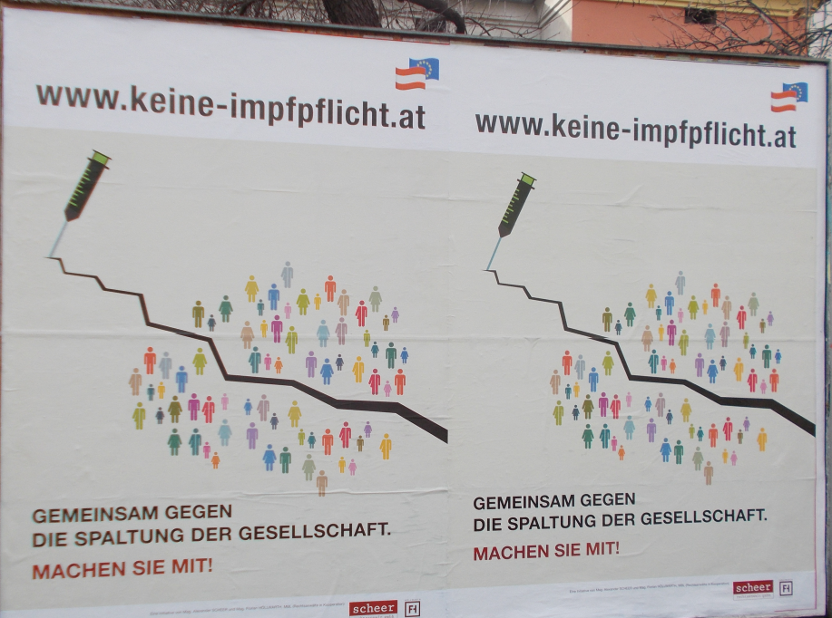
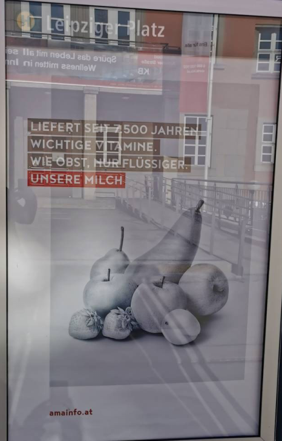

Hier die "Highlights" des Jänner '22.

# Tabak

# Glücksspiel

# Impfpflicht

Diese Werbung wurde von den Anwälten Scheer und Höllwarth österreichweit
inseriert. Die beiden Anwälte sind der Corona-Leugner-Szene zuzuordnen.

# Milch

Dieses Citylight am Leipziger Platz ist eine besondere Dreistigkeit und fällt in
den Bereich der gezielten Desinformation. Die AMA ist eine Körperschaft
öffentlichen Rechts und dem Landwirtschaftsministerium unterstellt. Pro-Fleisch-
und Pro-Milch-Kampagnen werden [nicht erst seit
heuer](https://www.youtube.com/watch?v=0cQk63WPbPc) betrieben.
Während die Tierhaltung in Bezug aufs CO2-Budget eines der größten Probleme im 
Landwirtschaftssektor ist, und zudem untrennbar mit Tierleid verbunden, bedient
die AMA Mythen und Halbwahrheiten um den Status Quo der Tierindustrie zu
verteidigen. 
